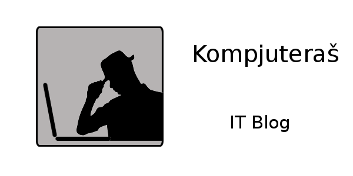

<h2 align="center"> Šta je net neutralnost?</h2>

Net neutralnost je princip po kojem Internet provajderi i države koje regulišu Internet moraju da tretiraju sav sadržaj na Internetu jednako, bez diskriminacije u odnosu na to ko pristupa sadržaju, kojem sadržaju pristupa, preko koje platforme pristupa ili tipu opreme koja se koristi za pristupanje Internet sadržaju.

<h2 align="center">Ko ugrožava net neutralnost?</h2>

Net neutralnost ugrožavaju Internet provajderi koji tretiraju neke Internet resurse u povlašćenom položaju u odnosu na druge, kao i vlade koje ne čine dovoljno da tu praksu zaustave.

<h2 align="center">Kako smo odlučili da se borimo za ovaj princip?</h2>

Da bismo ukazali na ovaj problem, odlučili smo na jedan dan "ugasiti" domaći Internet. Svi sajtovi izlistani u ovome su modifikovali

<h2 align="center">Kome smo se pridružili ovom akcijom?</h2>

Ovom akcijom smo se pridružili sajtovima kao što su Amazon, Kickstarter, Vimeo, GitHub, reddit, DigitalOcean, DuckDuckGo, EFF, Mozilla, imgur, Patreon, Vivaldi, World Wide Web Foundation i drugim. Dok ti sajtovi traže specifičnu akciju (ostavljanje komentara tako da neutralnost Interneta ne bude narušena unutar SAD-a), mi smo tu da im pružimo podršku i da spomenemo ovaj problem na lokalnom nivou.

<h2 align="center">Podijeli akciju</h2>

	

		
	

<!--<h2 align="center">Zakonska regulativa</h2>

<figure class="half">
	
	
	
	
	
	
	<figcaption></figcaption>
</figure>-->

<h2 align="center">Akciji se pridružili</h2>

Ukoliko želite da se pridružite akciji i da provedete dan javno govoreći o principu net neutralnosti, kontakirajte nas na <a href="mailto:kontakt@netneutralnost.com">kontakt@netneutralnost.com</a>.

<h4 align="center">Ugašeni sajtovi</h4>

<figure class="third">
	
	
	
	<figcaption></figcaption>
</figure>

<h4 align="center">Modifikovani sajtovi</h4>

<figure class="third">
	
	
	
	<figcaption></figcaption>
</figure>

<h4 align="center">Sajtovi koji će pričati o ovome problemu</h4>

<figure class="third">
	
	
	
	<figcaption></figcaption>
</figure>


